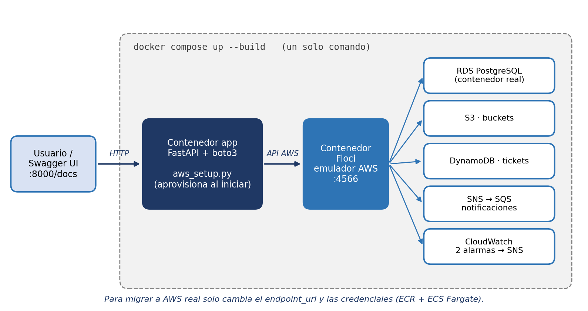

# Caso de estudio · Infraestructura Viva
*AWS de punta a punta, en local y con cero costo* — Martha Lizardo Álvarez · Bootcamp Cloud Architecture (Talento Digital para Chile)

## Descripción de la actividad
En el Módulo 4 el desafío era llevar a la práctica una arquitectura diseñada en papel: base de datos relacional con consultas de negocio, almacenamiento de objetos, tabla NoSQL, mensajería asíncrona y un plan de monitoreo con alarmas. El entregable debía demostrar que la arquitectura funciona, no solo describirla.

## Desafío principal
Validar seis servicios AWS integrados sin incurrir en costos ni depender de credenciales temporales, de forma que el mismo código sirviera después en AWS real.

## Solución propuesta
Dos contenedores orquestados con Docker Compose: **Floci** (emulador de AWS de código abierto, puerto 4566) y una **API FastAPI** que al iniciar aprovisiona toda la infraestructura con boto3: buckets S3, tabla DynamoDB, tema SNS suscrito a una cola SQS, instancia RDS PostgreSQL con esquema y datos de prueba, y dos alarmas de CloudWatch conectadas a SNS. El código no tiene nada específico del emulador salvo el `endpoint_url`.

**Obstáculo resuelto:** Floci no implementa un evaluador periódico de alarmas, y `SetAlarmState` no ejecuta las `AlarmActions`. Lo documenté y creé `POST /cloudwatch/simular-alarma`, que publica explícitamente en SNS al forzar `ALARM`. La configuración de las alarmas es idéntica a la de AWS real.

## Herramientas y justificación
| Herramienta | Por qué la elegí |
|---|---|
| Floci | Probar llamadas reales de AWS sin costo ni credenciales temporales |
| Docker Compose | Reproducir todo el entorno con un solo comando |
| FastAPI + Swagger UI | Exponer cada servicio de forma verificable, sin escribir código |
| boto3 / AWS CLI | SDK oficial: el mismo código sirve para migrar a la nube real |
| PostgreSQL (RDS) y DynamoDB | Comparar el modelo relacional con el NoSQL sobre datos reales |

## Métricas de impacto
| Indicador | Resultado |
|---|---|
| Servicios AWS aprovisionados por código | 6 |
| Comandos para levantar el entorno | 1 (`docker compose up --build`) |
| Primer arranque completo | 30 a 60 segundos |
| Endpoints funcionales | 16 |
| Consultas validadas | 5 SQL + 1 NoSQL |
| Alarmas con notificación | 2 (CloudWatch → SNS) |
| Cambios de lógica para migrar a AWS real | 0 (solo `endpoint_url` y credenciales IAM) |
| Costo de ejecución en AWS | 0 USD |

## Principales aprendizajes
- Un emulador reproduce la API, pero no todo el comportamiento: hay que probar supuestos y documentar diferencias.
- El código portable reduce el costo de pasar de prototipo a producción.
- La infraestructura aprovisionada por código es reproducible y verificable.
- Un README claro es parte del producto.

## Habilidades técnicas aplicadas
AWS (RDS, S3, DynamoDB, SNS/SQS, CloudWatch), Python, FastAPI, boto3, Docker Compose, SQL y NoSQL, troubleshooting y documentación técnica.

## Por qué lo elegí para mi portafolio
Es mi proyecto técnicamente más completo: integra seis servicios, cualquier persona puede ejecutarlo con un comando y documenta un obstáculo real con su causa y solución. Refleja mi perfil híbrido: mirada de QA para verificar cada componente y mirada de arquitectura cloud para que el prototipo esté listo para escalar.

**Contacto:** [GitHub](https://github.com/Martliz) · [LinkedIn](https://linkedin.com/in/martha-lizardo-a6ab4424a) · lizalmarga@gmail.com
